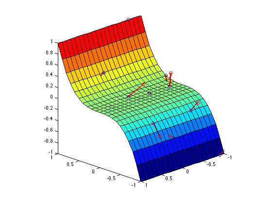
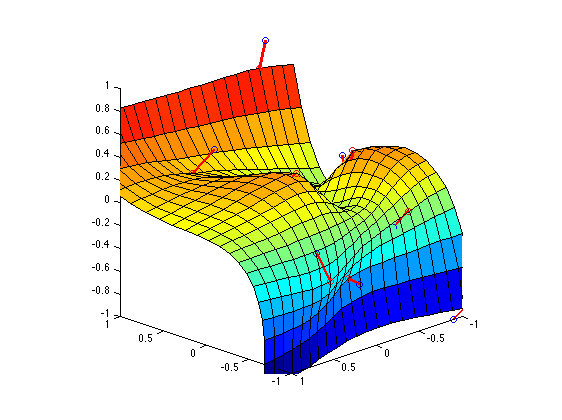

Thin Plate Spline Interpolation and Deformation
===============

Compute thin plate spline interpolation and deformation on a 3D surface.

## Interpolation

- Control points: points on the surface to perform the interpolation
(blue points on Figure 1 and 2).
- Displacements: displacements of the interpolated control points
(red edges on Figure 1 and 2).

Usage:  `[mapping_coeffs, poly_coeffs] =
             find_tps_coefficients(control_points, displacemets)`

#### Figure 1: Input data



## Deformation

This basically is a 3D version of the function y(x) on this page:
 https://en.wikipedia.org/wiki/Polyharmonic_spline

- Mapping coefficients: weights of the basis function. Same as vector **w**.
- Polynomial coefficients: weights **v** of the polynomial. Example: in 3D,
    v1 + v2 \* x + v3 \* y + v4 \* z.
- Control points: same as above.

Usage: `[fX, fY, fZ] = deform_surface_tps(X, Y, Z, control_points,
             mapping_coeffs, poly_coeffs)`

### Figure 2: Result

Result of `demos/tps_interp_demo.m` using 10 randomly chosen control points and
displacements.



## Documentation

### find_tps_coefficients.m

```
% FIND_TPS_COEFFICIENTS - Given a set of control points and their
% displacements, compute the coefficients of the TPS interpolant f(S)
% deforming surface S.
%
% Usage:    [mapping_coeffs, poly_coeffs] = ...
%               find_tps_coefficients(control_points, displacemets);
%
% Arguments:
%           control_points - p by d vector of control points.
%           displacemets   - p by d vector of displacements of
%                            corresponding control points in the mapping
%                            function f(S).
%
% Returns:
%           mapping_coeffs - p by d vector of TPS mapping coefficients.
%           poly_coeffs    - d+1 by d vector of TPS polynomial weights.
%
% References:
%           1. http://en.wikipedia.org/wiki/Polyharmonic_spline
%           2. http://en.wikipedia.org/wiki/Thin_plate_spline
```

### deform_surface_tps.m

```
% DEFORM_SURFACE_TPS - Given a set of control points and mapping
% coefficients, compute a deformed surface f(S) using a thin plate spline
% radial basis function phi(r) as shown in [1].
%
% Usage:    [fX, fY, fZ] = deform_surface_tps(X, Y, Z, control_points, ...
%               mapping_coeffs, poly_coeffs)
%
% Arguments:
%           X, Y, Z        - h by w matrices of X, Y, Z components of the
%                            surface.
%           control_points - p by 3 vector of control points. Same as
%                            vector c in [1].
%           mapping_coeffs - p by 3 vector of weights of the basis
%                            functions. Same as vector w in [1].
%           poly_coeffs    - 4 by 3 vector of weights of the polynomial.
%                            Same as vector v in [1].
%
% Returns:
%           fX, fY, fZ     - h by w vectors of X, Y, Z compoments of the
%                            deformed surface.
%
% References:
%           1. http://en.wikipedia.org/wiki/Polyharmonic_spline
```
